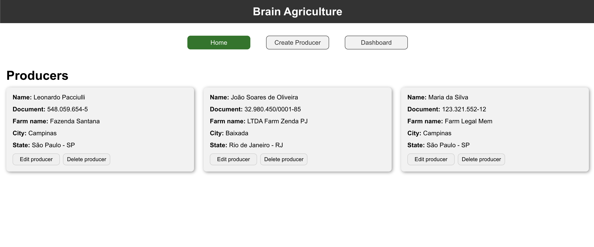
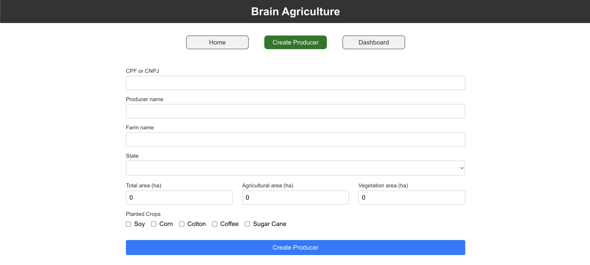
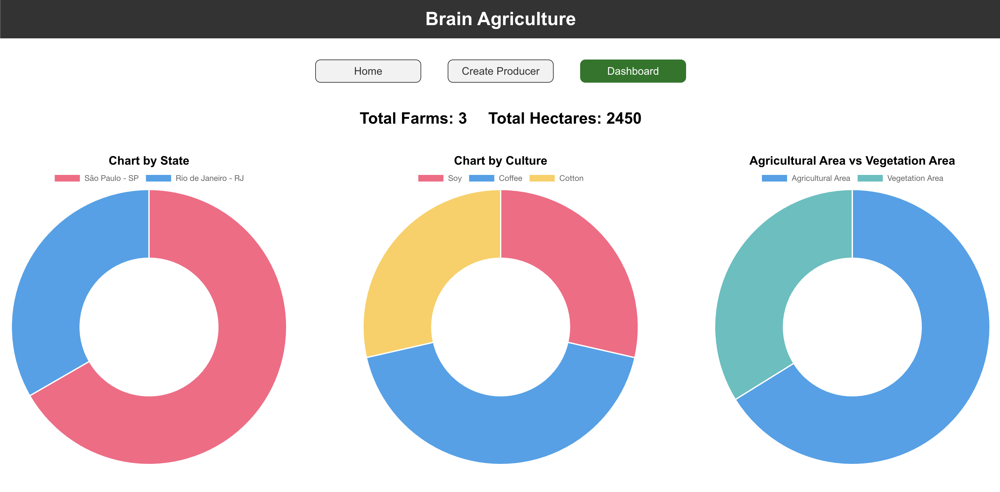

### 📝 About the project

The test consists of registering, editing, listing and deleting Rural Producers, as well as a graph section with some information regarding the Farms registered in the system.

<br>

## 🖥 Front-End Technologies

React.JS, Next.JS, Typescript, Redux, styled-components, Jest, chart.js, formik and yup.

## 🏁 Starting the project

🖥 To run the **Front-End**, execute the following commands:

```zsh
# run the project
$ npm run dev

# Now access `http://localhost:3000/`
```

<br>

🖥 To run the **Unit tests**, execute the following commands:

```zsh
# run the tests
$ npm test
```

---

<div align="center">
  
</div>

<div align="center">
  
</div>

<div align="center">
  
</div>

---

<h3 align="center">
  Made by Leonardo Pacciulli
</h3>

<p align="center">
  <a href="https://www.linkedin.com/in/leonardo-pacciulli">
    
  </a>
</p>
